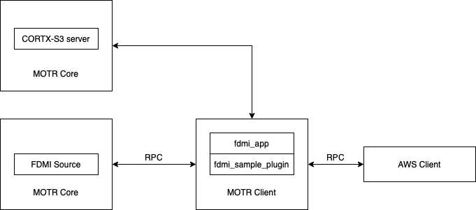

## Welcome to CORTX FDMI Word Count Application

CORTX is an object storage systems that allows to attach a FDMI application or plugin to the cluster server that can extend or add more functionalities and features to the storage system.

In this case, CORTX exports a more flexible API to include complex tasks to the system such as replication, deduplication, etc.
 
One example of such FDMI application is the `fdmi_app` that works as a python wrapper of the `fdmi_sample_plugin` executable written in C.

The `fdmi_app_word` runs the plugin executable and takes the cluster configuration parameters from default directory `/etc/motr/conf.xc` or as an input.
Then it starts listening for new S3 requests and create/print to stdout an event with the corresponding metadata fields. 

### The Goal of this project
Create an FDMI application that takes the Object-name and Bucket-name information from S3 requests from the AWS client, reads the Object data and print the number of ocurrences of each word.

## Code Sckeleton
```
Create a new function that does the word count
  # Process the KV record and data obtained from the fdmi_sample_plugin
  # Decode the record from hex and binary format
  # Convert to string
  # Get the Object-name and Bucket-name
  # Connect to AWS client and request Object data
  # Convert Object data to string
  # Remove quotation marks and punctuation
  # Count the number of ocurrences of each word (Every word converted to lowercase Ex.: The and the should be counted as the same word)
  # Store in a dictionary
  # Print the 40 most popular words
```

### Network Architecture



FDMI Motr architecture. 
Each FDMI application is initialized as a Motr Client that communicates with Motr Core by using Remote Procedure Calls (RPCs). 
The AWS Client also communicates with Motr via CORTX S3-server that runs on top of Motr core. 
 


